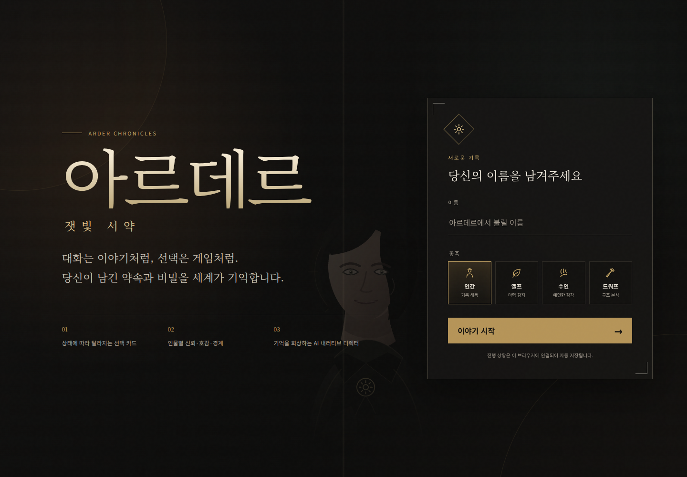
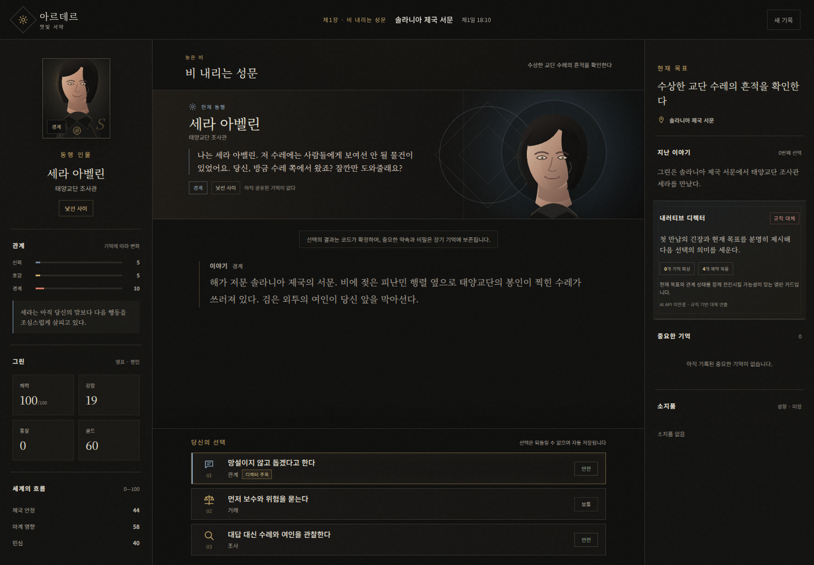
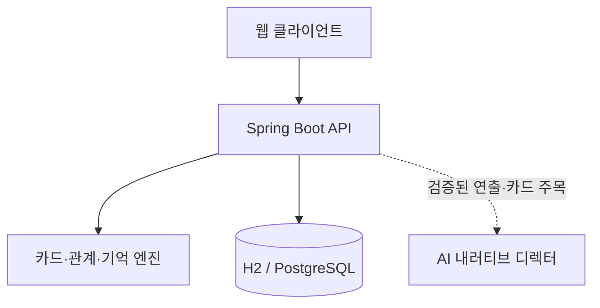

# Fantasy Sim · 아르데르: 잿빛 서약

> 대화는 이야기처럼, 선택은 게임처럼. 플레이어가 남긴 약속과 비밀을 세계가 기억하는 카드 선택형 캐릭터 챗 RPG.



기존 턴제 판타지 시뮬레이터를 **직접 플레이 가능한 웹 버티컬 슬라이스**로 확장한 프로젝트입니다. 자연어 입력의 불확실성은 카드 선택으로 줄이고, 관계·상태·분기·기억은 Java 규칙 엔진이 일관되게 판정합니다.

## 프로젝트 요약

| 구분 | 내용 |
|---|---|
| 결과물 | 15~20분 분량의 플레이 가능한 데스크톱 웹 버티컬 슬라이스 |
| 핵심 경험 | 세라와의 관계 변화, 조건부 카드, 잠긴 비밀 루트, 구조화 장기 기억 |
| 기준 화면 | 1440×1000, 1366×768 데스크톱·노트북 |
| 백엔드 | Java 17, Spring Boot, JDBC, H2/PostgreSQL |
| 품질 상태 | 자동 테스트 23/23, 실행형 JAR·재시작 복구, 기존 Chromium E2E, AI 디렉터 안전 경계 검증 완료 |
| 목적 | 학습 및 게임/제품 QA·기획 직무 포트폴리오 |

## 실제 화면

### 캐릭터와 현재 대화가 중심인 플레이 화면



### 관계와 기억이 누적된 제2장 거점


## 핵심 기능

- 이름과 종족(`human`, `elf`, `beast`, `dwarf`)을 선택해 새 캠페인 생성
- 종족·소지품·관계·과거 선택에 따라 달라지는 카드와 잠금 조건
- 세라 아벨린의 신뢰·호감·경계 및 관계 단계 변화
- 체력·강함·골드·통찰, 제국 안정·마계 영향·민심의 코드 기반 판정
- 약속·비밀·거래·구조·서약을 검색 가능한 구조화 기억으로 저장
- 30일 제한 없이 거점과 사건을 오가는 열린 캠페인
- 브라우저 새로고침과 서버 재시작 후에도 이어하기
- 같은 선택 요청이 재전송돼도 결과를 한 번만 적용하는 멱등 처리
- 게스트 접근 토큰 원문 대신 SHA-256 해시 저장
- AI 제공자가 없거나 실패해도 확정 원문으로 정상 플레이
- AI 디렉터의 라이브 연결 여부, 연출 의도, 회상 기억과 주목 카드를 화면에 표시
- 기존 CLI와 `/api/sessions` API의 호환 유지

## 검증 결과

2026년 7월 18일 최종 빌드를 새 H2 파일 DB에서 직접 실행해 검증했습니다.

| 검증 항목 | 결과 |
|---|---:|
| JUnit 단위·통합 테스트 | **23/23 통과** |
| AI 대체·모의 라이브·키 없는 제공자·무효 출력 검증 | **4/4 통과** |
| 새 캠페인 → 8회 선택 → 제2장 거점 | 통과 |
| 신뢰 조건 및 전령 구출에 따른 비밀 카드 해금 | 통과 |
| 중요 기억 7개 저장 및 후속 대사 반영 | 통과 |
| 브라우저 새로고침 후 이어하기 | 통과 |
| 서버 완전 종료·재시작 후 8턴 상태 복구 | 통과 |
| 1440×1000 / 1366×768 가로 넘침 | **0px** |
| 노트북 화면의 선택 카드 5개 노출 | **5/5** |
| WCAG 2 A/AA 자동 접근성 위반 | **0건** |
| 콘솔·페이지·네트워크 오류 | **0건** |
| Docker + PostgreSQL 실제 기동 | **환경 차단** — 현재 실행기에 런타임 없음 |
| 실제 외부 AI 제공자 호출 | **환경 차단** — 접속값·로컬 모델 없음 |

상세 시나리오와 잔여 위험은 [QA 보고서](docs/Fantasy_Simulator_QA_Report.md), [기계 판독용 QA 증거](docs/qa-evidence.json), [QA PDF](portfolio/Arder_QA_Report_KO.pdf)에 정리했습니다.


## 설계 핵심

### 규칙과 문장 생성의 경계

카드 목록, 잠금 조건, 성공·실패, 수치, 아이템, 플래그, 기억은 Java 코드가 확정합니다. 선택적으로 연결할 수 있는 AI 디렉터는 장면 묘사와 인물 대사를 변주하고, 현재 열린 카드 하나를 주목시킵니다. 모델이 반환한 카드·기억 ID를 서버가 다시 검증하며, 장애나 변경이 게임 규칙을 뒤집지 않도록 책임을 분리했습니다.

### 구조화 장기 기억

기억은 대화 전문만 저장하지 않습니다. `type`, `subject`, `importance`, `tags`, `turn`을 함께 기록해 “세라와 관련된 중요 약속”이나 “구조한 사건”을 코드가 안정적으로 다시 찾고 후속 대사와 분기에 사용할 수 있습니다.

### 저장과 중복 방지

캠페인 전체를 버전이 있는 JSON 스냅샷으로 저장합니다. 버전 조건부 갱신과 `requestId` 기록을 함께 사용해 빠른 연속 클릭이나 네트워크 재시도가 동일한 효과를 두 번 적용하지 않도록 했습니다.

## 구조



- `fantasy-sim-core`: 기존 시뮬레이션 엔진과 카드형 캠페인·기억·관계 규칙
- `fantasy-sim-api`: Spring Boot API, 영속 저장, 게스트 토큰, 웹 UI
- `fantasy-sim-cli`: 기존 터미널 플레이
- `docs/service_v2.md`: 제품 구조와 기억 설계
- `docs/Fantasy_Simulator_QA_Report.md`: 테스트 범위, 결과, 결함 및 제한 사항
- `portfolio/`: 제품 포트폴리오, 기획서, QA 보고서 PDF

## 포트폴리오 문서

- [제품 포트폴리오](portfolio/Arder_Product_Portfolio_KO.pdf)
- [제품·게임 기획서](portfolio/Arder_Product_Planning_Document_KO.pdf)
- [QA 보고서](portfolio/Arder_QA_Report_KO.pdf)

## 빠른 실행

Java 17 이상이 필요합니다.

```bash
./mvnw test
./mvnw -DskipTests package
java -jar fantasy-sim-api/target/fantasy-sim-api-2.1.0.jar
```

실행형 JAR과 파일 DB의 재시작 복구를 자동 확인하려면 `./scripts/verify-jar.sh`를 실행할 수 있습니다.

브라우저에서 `http://localhost:8080`을 열면 됩니다. 로컬 실행은 `./data`의 H2 파일 DB를 사용합니다.

Windows에서는 다음 명령을 사용할 수 있습니다.

```powershell
mvnw.cmd test
mvnw.cmd -DskipTests package
java -jar fantasy-sim-api/target/fantasy-sim-api-2.1.0.jar
```

## Docker + PostgreSQL

```bash
cp env.example .env
# .env의 POSTGRES_PASSWORD를 충분히 긴 임의 값으로 교체
docker compose up --build
```

앱은 `http://localhost:8080`에서 열립니다. 운영 프로필은 DB 접속값이 없으면 시작 자체를 거부하고, 컨테이너 헬스체크는 API와 DB를 함께 확인합니다. 로컬에서 만든 `.env`는 저장소에 업로드하지 말고, 공개 환경에서는 플랫폼 Secret을 사용해야 합니다.

Docker와 PostgreSQL의 이미지 기동, 실제 저장, 앱 재시작 후 복구까지 한 번에 확인하려면 다음 스모크 테스트를 사용합니다.

```bash
POSTGRES_PASSWORD='<임시 검증용 비밀번호>' ./scripts/verify-compose.sh
```

현재 실행 환경에는 Docker가 없어 컨테이너 기동은 미검증이며, JAR 실행·H2 영속 저장·서버 재시작 복구는 실제 검증했습니다.

## API 예시

### 캠페인 생성

```bash
curl -X POST http://localhost:8080/api/v2/campaigns \
  -H 'Content-Type: application/json' \
  -d '{"playerName":"그린","race":"elf","seed":12345}'
```

응답의 `accessToken`은 생성할 때 한 번만 반환됩니다.

### 카드 선택

```bash
curl -X POST http://localhost:8080/api/v2/campaigns/<CAMPAIGN_ID>/choices \
  -H 'Content-Type: application/json' \
  -H 'X-Campaign-Token: <ACCESS_TOKEN>' \
  -d '{"choiceId":"arrival_help","requestId":"client-request-001"}'
```

### 이어하기

```bash
curl http://localhost:8080/api/v2/campaigns/<CAMPAIGN_ID> \
  -H 'X-Campaign-Token: <ACCESS_TOKEN>'
```

## 환경 변수

| 환경 변수 | 용도 | 기본값 |
|---|---|---|
| `DB_URL` | JDBC 연결 URL | 로컬 H2 파일 DB |
| `DB_USERNAME` | DB 사용자 | `sa` |
| `DB_PASSWORD` | DB 비밀번호 | 빈 문자열 |
| `FANTASY_AI_ENDPOINT` | OpenAI 호환 chat-completions URL | 비활성 |
| `FANTASY_AI_API_KEY` | 내러티브 디렉터 제공자 키 | 비활성 |
| `FANTASY_AI_MODEL` | 내러티브 디렉터 모델명 | 비활성 |

실제 AI 제공자의 응답이 `LIVE_AI`로 채택되고 열린 카드만 주목하는지 확인하는 스모크 테스트도 제공합니다. 키가 필요 없는 신뢰된 로컬 OpenAI 호환 제공자는 `FANTASY_AI_API_KEY`를 비워둘 수 있습니다.

```bash
FANTASY_AI_ENDPOINT='https://provider.example/v1/chat/completions' \
FANTASY_AI_API_KEY='<secret>' \
FANTASY_AI_MODEL='<model>' \
./scripts/verify-live-ai.sh
```

## 제작 방식과 기여

이 프로젝트는 **AI 보조 개발 방식**으로 제작했습니다. 프로젝트 오너가 제품 방향, 기능 범위, 우선순위, 화면 피드백, 예외 조건, 테스트 시나리오와 합격 기준을 정하고, AI 코딩 도구가 구현과 반복 수정에 참여했습니다. 결과물은 자동 테스트 수치만으로 판정하지 않고 실제 서버·브라우저·DB를 연결해 재현 가능한 흐름으로 검증했습니다.

이번 버전의 목적은 대규모 상용 서비스가 아니라 **상용 서비스처럼 설계되고 검증된 취업·학습용 버티컬 슬라이스**입니다. 계정, 결제, 관리자 도구, 운영 대시보드는 의도적으로 범위에서 제외했습니다.
