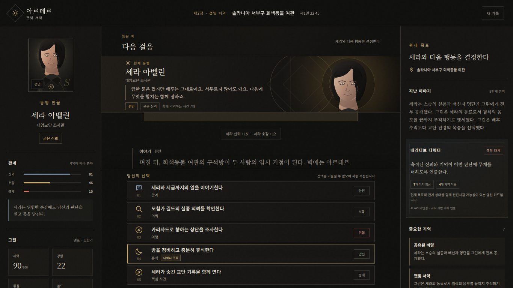

# Fantasy Simulator QA Report

## 아르데르: 잿빛 서약 · 서비스형 버티컬 슬라이스

| 항목 | 내용 |
|---|---|
| 테스트 대상 | `fantasy-sim` 2.1.0 최종 작업 트리 |
| 테스트 일시 | 2026-07-18 (KST) |
| 판정 | **LOCAL PASS / EXTERNAL BLOCKED - Docker·실AI·신규 UI 육안 검증 후속 필요** |
| 기준 화면 | 데스크톱 1440×1000, 노트북 1366×768 |
| 실행 환경 | Java 17.0.19, Spring Boot 3.3.5, Chromium Headless 기준선, H2 File DB (Docker·PostgreSQL·Ollama 없음) |

## 1. 요약

최종 빌드는 카드 선택형 캐릭터 챗 RPG의 핵심 흐름을 정상적으로 수행했습니다. 새 캠페인 생성부터 8회 선택, 제2장 거점 진입, 비밀 루트 해금, 중요 기억 저장, 새로고침 복구, 서버 완전 재시작 후 복구까지 실제 API와 파일 DB를 거쳐 검증했습니다.

자동 테스트 **23/23**, 실행형 JAR의 DB 포함 헬스체크·캠페인 생성·선택·프로세스 재시작 복구를 통과했습니다. 운영 프로필은 DB 설정이 없을 때 종료되어 로컬 H2로 조용히 폴백하지 않습니다. 기존 화면의 WCAG 2 A/AA 자동 접근성 검사 **0건**, 브라우저 콘솔·페이지·네트워크 오류 **0건**, 두 기준 해상도의 가로 넘침 **0px** 기준선도 유지됩니다.

Docker/Podman 데몬과 PostgreSQL 실행 파일, 실제 AI 접속값 및 로컬 모델은 이 실행 환경에 존재하지 않았습니다. 따라서 Compose·PostgreSQL 실기동과 외부 AI 응답은 `PASS`가 아니라 **환경 차단(BLOCKED)** 으로 판정했습니다. 대신 배포 정의·Secret 처리·운영 실패 안전성을 정적으로 검증하고, 외부 실행기에서 같은 검사를 재현하는 스모크 스크립트를 추가했습니다. AI 디렉터 변경분은 이 보고서와 [기계 판독용 QA 증거](qa-evidence.json)에 통합해 기록했습니다.

## 2. 테스트 범위

### 포함

- 카드·관계·기억·분기 규칙의 단위 테스트
- 캠페인 생성·조회·선택 API 통합 테스트
- AI 미연결 규칙 대체와 모의 라이브 모델 응답 검증
- AI가 만든 가짜 카드·기억 ID의 서버 측 차단
- 잘못된 토큰과 누락된 토큰의 접근 차단
- 같은 `requestId` 재전송 시 1회만 반영되는지 확인
- 실행형 JAR 빌드 및 실제 Spring Boot 서버 기동
- 실행형 JAR의 DB 포함 헬스체크와 프로세스 재시작 복구
- 운영 프로필의 필수 DB 설정 누락 시 기동 거부
- Compose YAML·Dockerfile·비밀값 주입·비루트/읽기 전용 설정 정적 검사
- DB 장애 시 헬스체크 `503 Service Unavailable` 반환
- 새 H2 파일 DB를 사용한 저장과 이어하기
- 실제 Chromium에서 랜딩·게임·거점 화면 조작
- 1440×1000, 1366×768 레이아웃과 선택 카드 노출
- WCAG 2 A/AA 자동 접근성 검사
- 브라우저 콘솔 오류, 페이지 예외, 실패한 네트워크 요청 수집
- 서버 종료·재시작 후 캠페인 상태 복구

### 제외

- Docker 컨테이너 실제 기동: 런타임 없음
- PostgreSQL 컨테이너 연동: 서버/클라이언트 없음
- 외부 AI 문장 변주 제공자 호출: 접속값·로컬 모델 없음
- AI 디렉터 신규 패널의 실제 Chromium 육안·클릭 검사
- Firefox·Safari 실브라우저 교차 검사
- 부하·장시간 안정성·대규모 동시성 시험
- 계정·결제·관리자 기능: 프로젝트 범위에 포함되지 않음

## 3. 자동 테스트 결과

| 모듈 | 테스트 수 | 실패 | 오류 | 결과 |
|---|---:|---:|---:|---|
| `fantasy-sim-core` | 13 | 0 | 0 | PASS |
| `fantasy-sim-api` | 10 | 0 | 0 | PASS |
| 합계 | **23** | **0** | **0** | **PASS** |

주요 검증 항목:

- 종족별 전용 카드 생성
- 중복 요청의 효과 중복 적용 방지
- 중요한 선택의 구조화 기억 변환
- 30일 이후에도 캠페인이 종료되지 않는 열린 루프
- API 생성·선택·조회 및 토큰 검증
- 재조회 응답에서 접근 토큰 원문 미노출
- 정적 웹 클라이언트 제공
- AI 디렉터의 라이브/대체 상태와 판단 근거 API 노출
- 모델 출력의 열린 카드·활성 기억 ID 검증
- 키가 필요 없는 신뢰된 로컬 OpenAI 호환 제공자 지원
- 빈 AI 출력 시 확정 원문과 규칙 추천 유지
- DB 장애 시 준비 상태를 정상으로 오판하지 않음
- 세계관 데이터와 수치 경계 검증

실행 명령:

```bash
./mvnw -o -Dmaven.repo.local=../.m2 test package
```

결과: `BUILD SUCCESS`, Tests run: 23, Failures: 0, Errors: 0, Skipped: 0.

## 4. 배포 계층·실제 연결 검증

| 검증 항목 | 결과 | 근거 |
|---|---|---|
| Compose/Dockerfile 구조 | PASS | YAML 파싱, 서비스·헬스체크·운영 프로필·비루트·읽기 전용 파일시스템 검사 |
| 비밀값 처리 | PASS | 고정 DB 비밀번호 제거, 업로드 패키지에 `.env` 미포함, 미설정 시 Compose 보간 실패 |
| 운영 프로필 DB 누락 | PASS | 최종 JAR가 종료 코드 1로 기동 거부, H2 접속 흔적 없음 |
| 최종 28,391,815바이트 JAR | PASS | 헬스체크, 동시 중복 선택 1회 반영, 종료·재시작 후 1턴/버전 2 복구 |
| DB 포함 헬스체크 | PASS | 정상 DB에서 `200/up`, DB 예외 단위 테스트에서 `503/down` |
| Docker/Podman 실기동 | **BLOCKED** | 명령·소켓·daemon 모두 없음; `verify-compose.sh`가 종료 코드 2로 정확히 차단 |
| PostgreSQL 실연동 | **BLOCKED** | `postgres`, `psql`, `initdb`, `pg_ctl` 모두 없음 |
| 외부 AI 라이브 응답 | **BLOCKED** | `FANTASY_AI_*` 미설정, `OPENAI_*` 미설정, Ollama와 로컬 모델 없음 |
| AI 모의 HTTP·안전 경계 | PASS | 라이브 응답 반영, 가짜 카드 거부, 가짜 기억 제거, 키 없는 제공자, 무효 출력 대체 |
| 실연결 재현 수단 | READY | `scripts/verify-compose.sh`, `scripts/verify-live-ai.sh` 문법·사전조건 게이트 통과 |

JAR SHA-256: `238e294cb87006d221fe73bd7774268196b3305f713552d175593ff099e90a14`

`BLOCKED`는 실패를 통과로 둔갑시키지 않기 위한 판정입니다. Docker가 있는 실행기와 실제 제공자 Secret이 준비되면 두 스크립트가 각각 PostgreSQL 저장·앱 재시작 복구와 `LIVE_AI` 채택·열린 카드 검증을 수행합니다.

## 5. 기존 데스크톱 실제 브라우저 E2E 시나리오

아래 결과는 AI 디렉터 패널을 추가하기 전의 동일 게임 루프와 데스크톱 셸을 대상으로 수행한 기준선입니다. 신규 디렉터 카드와 주목 배지의 육안 결과로 확대 해석하지 않습니다.

| 순서 | 조작 | 기대 결과 | 실제 결과 |
|---:|---|---|---|
| 1 | 랜딩 화면 접속 | 한글 폰트·SVG 초상·종족 카드 정상 표시 | PASS |
| 2 | 이름 `그린`, 종족 `엘프`로 시작 | 새 캠페인 생성, 첫 장면 표시 | PASS |
| 3 | 첫 동행 약속 선택 | `PROMISE` 기억과 관계 변화 저장 | PASS |
| 4 | 엘프 전용 마력 카드 선택 | 종족 전용 분기와 `DISCOVERY` 기억 반영 | PASS |
| 5 | 월식 파편을 세라에게 전달 | 신뢰와 파편 관련 기억 반영 | PASS |
| 6 | 매복에서 세라를 지킴 | 전투 결과와 관계 변화 반영 | PASS |
| 7 | 교단 전령 구출 | 구출 플래그와 기억 반영 | PASS |
| 8 | 동료 서약 선택 | 제2장 거점 진입, 직업 `모험가` 반영 | PASS |
| 9 | 잠긴 비밀 카드 확인 | 조건 충족으로 선택 가능 | PASS |
| 10 | 비밀 기록 공유 | `공유된 비밀` 기억 저장 | PASS |
| 11 | 새로고침 후 이어하기 | 8턴·기억 7개·거점 상태 복구 | PASS |
| 12 | 서버 종료 후 재시작 | 파일 DB에서 동일 상태 복구 | PASS |

### 제2장 거점 도달 시점

- 선택 횟수: 6
- 중요 기억: 6개
- 세라 신뢰/호감/경계: 66 / 34 / 10
- 비밀 카드: 잠금 해제

### 비밀 기록 완료 시점

- 선택 횟수: 8
- 중요 기억: 7개
- 현재 장면: `다음 걸음`
- 확인된 핵심 기억: `공유된 비밀`, `잿빛 서약`, `교단 전령 구출`, `등을 맡긴 첫 전투`, `월식 파편을 맡기다`, `왜곡의 흔적`, `첫 번째 동행`

## 6. UI·레이아웃 검증

| 항목 | 1440×1000 | 1366×768 |
|---|---:|---:|
| 문서 가로 넘침 | 0px | 0px |
| 거점 선택 카드 | 5/5 표시 | 5/5 표시 |
| 대화 기록 가용 높이 | 244px | 151px |
| 세라 SVG 초상 로드 | 정상 | 정상 |
| 자체 한글 웹폰트 적용 | 정상 | 정상 |

기존 기준선 육안 확인 결과 랜딩, 첫 장면, 제2장 거점, 서버 재시작 후 복구 화면에서 글자 깨짐·잘림, 패널 겹침, 검은 미도장 영역, SVG 누락을 발견하지 못했습니다. 이후 추가된 디렉터 카드는 우측 스크롤 패널 안에 배치했지만 최종 육안 확인은 후속 항목입니다.



## 7. 접근성·브라우저 안정성

| 검사 | 결과 |
|---|---:|
| 랜딩 WCAG 2 A/AA 자동 위반 | 0건 |
| 첫 게임 화면 WCAG 2 A/AA 자동 위반 | 0건 |
| 제2장 거점 WCAG 2 A/AA 자동 위반 | 0건 |
| 1366×768 거점 WCAG 2 A/AA 자동 위반 | 0건 |
| 콘솔 오류 | 0건 |
| 처리되지 않은 페이지 예외 | 0건 |
| 실패한 네트워크 요청 | 0건 |

자동 검사는 모든 접근성 문제를 보장하지 않지만, 제목 단계, 레이블, 키보드 포커스, 상태·기록 패널의 접근성 속성, 색 대비와 같은 구현 항목을 함께 확인했습니다.

## 8. QA 과정에서 발견하고 수정한 결함

| 결함 | 영향 | 조치 | 최종 상태 |
|---|---|---|---|
| API JAR가 실행형으로 재패키징되지 않음 | 배포 산출물 직접 실행 불가 | Spring Boot `repackage` 실행 추가 | 해결 |
| 일부 환경에서 한글이 네모로 표시됨 | 가독성 훼손 | 라이선스가 포함된 한글 웹폰트 자체 제공 | 해결 |
| Unicode 기호가 환경별로 다르게 렌더링 | 아이콘 일관성 저하 | SVG 스프라이트 아이콘으로 통일 | 해결 |
| 낮은 대비와 제목 단계 경고 | 접근성 자동 검사 실패 | 색상·제목 구조 조정 | 해결 |
| 모바일 서랍의 키보드 포커스 복귀 미흡 | 키보드 조작 불편 | 포커스 관리와 `aria-expanded` 동기화 | 해결 |
| 고정 노이즈 혼합 레이어가 Chromium 재도장 방해 | 일부 패널이 검게 남는 잔상 | 합성 방식을 단순 투명 레이어로 변경 | 해결 |
| 1366×768에서 대화·선택 영역 높이 경쟁 | 노트북 화면 정보 밀도 저하 | 저높이 데스크톱 전용 압축 규칙 적용 | 해결 |
| Linux 실행에서 Maven Wrapper 실행 권한 누락 | README 명령 직접 실행 불가 | `mvnw` 실행 비트 추가 | 해결 |
| 운영 배포가 DB 값 없이 H2로 폴백할 가능성 | 배포 오류를 정상 기동으로 오판 | 필수 DB 값만 쓰는 `prod` 프로필과 Compose 활성화 | 해결 |
| 헬스체크가 DB 상태를 확인하지 않음 | DB 장애 중에도 트래픽 유입 가능 | `SELECT 1` 준비 상태 검사와 503 응답 추가 | 해결 |
| Compose에 DB 비밀번호 고정 | 저장소를 통한 인증 정보 노출·재사용 | 환경 변수 필수화, `env.example` 템플릿과 비밀값 미포함 원칙 추가 | 해결 |
| 키 없는 로컬 AI 호환 제공자를 구성 불가 | 로컬·사내 모델 검증 경로 제한 | 키가 없으면 Authorization 헤더를 생략하도록 변경 | 해결 |

## 9. 보안·데이터 무결성 확인

- 게스트 토큰이 없는 조회: `400 BAD_REQUEST`
- 잘못된 토큰 조회: `403 FORBIDDEN`
- 캠페인 생성 응답 외 재조회 응답: 토큰 원문 없음
- 동일 `requestId` 재전송: 턴·버전·효과가 두 번 증가하지 않음
- 카드 응답: 내부 `nextSceneId`와 `effect` 미노출
- 저장 방식: 버전이 있는 JSON 스냅샷과 조건부 갱신
- 서버 재시작: 8턴 상태와 중요 기억 7개 복구
- 운영 Compose: 비루트 사용자, 읽기 전용 루트, `no-new-privileges`, 임시 `/tmp`만 쓰기 허용
- 배포 비밀값: 업로드 패키지에 `.env` 미포함, Compose 파일에 실제 비밀번호 없음

## 10. 잔여 위험과 제한

| 항목 | 상태 | 영향 |
|---|---|---|
| Docker/PostgreSQL 실제 기동 | 환경 차단 | 실행 스크립트는 준비됐으나 현재 머신에 컨테이너 런타임·DB가 없음 |
| 외부 AI 제공자 | 환경 차단 | 접속값·로컬 모델이 없어 실제 `LIVE_AI` 근거 없음; 비활성 시 확정 원문으로 정상 동작 |
| AI 디렉터 신규 패널 육안 검사 | 후속 필요 | API·정적 연결은 통과했으나 실제 1366×768 렌더링은 미확인 |
| 브라우저 교차 검사 | Chromium만 수행 | Firefox·Safari의 미세한 렌더링 차이는 확인되지 않음 |
| 부하·동시성 시험 | 미수행 | 단일 사용자 버티컬 슬라이스 판정에는 영향이 작지만 공개 운영 근거는 아님 |
| 공개 배포 | 미수행 | 로컬 실행·API·DB 복구까지만 검증됨 |

## 11. 최종 판정

**로컬 릴리스 후보 PASS / 외부 인프라 검증 BLOCKED.** 현재 빌드는 게임 규칙, API, 파일 저장, DB 인지 헬스체크, AI 디렉터 안전 경계, 운영 실패 안전성과 패키징 기준을 충족합니다. 기존 데스크톱 UI와 게임 루프의 브라우저 기준선도 통과했습니다. 다만 Docker+PostgreSQL 실기동, 실제 AI 제공자 응답, 신규 디렉터 패널 육안 확인 전에는 “완전 배포 검증 PASS”로 판정하지 않습니다.

검증 화면:

- [랜딩](images/desktop-landing.png)
- [첫 장면](images/desktop-initial-game.png)
- [제2장 거점 1440×1000](images/desktop-hub.png)
- [제2장 거점 1366×768](images/desktop-1366x768.png)
- [서버 재시작 후 복구](images/desktop-resumed-after-restart.png)
- [기계 판독용 QA 증거](qa-evidence.json)
